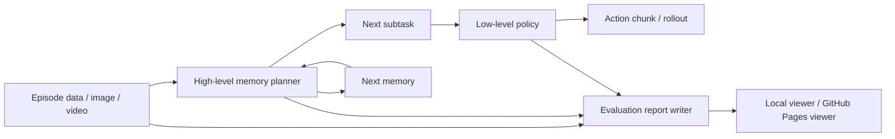

# open-pi-mem

Open research scaffold for reproducing a MEM-style hierarchical robot policy with explicit high-level memory, open data adapters, and inspectable RMBench-style evaluation reports.

> Status: research codebase / work in progress. The strongest part of the repository today is the high-level memory-planning loop and the viewer-ready Gemini reports. The full end-to-end low-level benchmark story is still incomplete.

## Live Demo

- GitHub Pages viewer: [wingagi.github.io/open-pi-mem](https://wingagi.github.io/open-pi-mem/)
- If the link is not live yet, enable Pages with `GitHub Actions` in the repository settings and wait for [`.github/workflows/pages.yml`](.github/workflows/pages.yml) to deploy.

## What This Repository Is

`open-pi-mem` is an open attempt to make the core MEM idea concrete and inspectable:

- a high-level planner updates memory over time
- a low-level policy consumes visual context, language, and optionally memory-conditioned subtasks
- evaluation artifacts are saved in a format that can be reviewed step by step

Current focus areas:

- single-frame high-level planning: `goal + image + prev_memory -> next_subtask + next_memory`
- RMBench video-based high-level evaluation with Gemini models
- a local and GitHub Pages-friendly viewer for report inspection
- minimal training and data scaffolding for open-data experiments

This is an open research scaffold, not an official release from Physical Intelligence. The design choices here are intentionally explicit where the paper is underspecified. See [`docs/design.md`](docs/design.md).

## Current Status

Completed:

- high-level inference from a local VLM on one image and textual memory state
- prompt and parsing logic for structured `<subtask>` and `<memory>` outputs
- manual and LLM-assisted memory-supervision data generation
- RMBench-style episode slicing for video evaluation
- saved comparison reports for `Gemini 3.1 Pro` and `Gemini Robotics-ER 1.5`
- a static viewer that can be deployed to GitHub Pages

Still in progress:

- full end-to-end MEM reproduction
- released checkpoints
- fully implemented high-level adapter inside low-level RMBench evaluation
- benchmark summary tables and stronger quantitative reporting
- deeper automated testing beyond smoke checks

## Pipeline Overview



## Quick Start

Install the base package:

```bash
python3 -m pip install -e .
```

For evaluation-related dependencies:

```bash
python3 -m pip install -e ".[eval]"
```

To build and preview the static viewer locally:

```bash
python3 scripts/run_test_viewer_app.py --host 127.0.0.1 --port 8766 --rebuild
```

Then open:

```text
http://127.0.0.1:8766/
```

## Included Results

The repository intentionally keeps viewer-ready qualitative artifacts in-repo under [`data/eval_results/`](data/eval_results), including:

- [`data/eval_results/Gemini_3_1_Pro`](data/eval_results/Gemini_3_1_Pro)
- [`data/eval_results/Gemini_Robotics_ER_1_5`](data/eval_results/Gemini_Robotics_ER_1_5)

These saved reports make it easy to inspect:

- how memory is updated over time
- whether subtasks stay atomic
- where models advance too early or remain conservative
- how two Gemini variants behave on the same task family

The GitHub Pages deployment publishes a curated subset of demos for size and reliability; the full report archive remains available in the repository.

## Documentation

- [Getting Started](docs/getting_started.md)
- [Data Formats And Results](docs/data_formats.md)
- [Design Notes](docs/design.md)
- [Contributing](CONTRIBUTING.md)

## References

- Torne et al., [MEM: Multi-Scale Embodied Memory for Vision Language Action Models](https://www.pi.website/download/Mem.pdf)
- Physical Intelligence, [VLAs with Long and Short-Term Memory](https://www.pi.website/research/memory)

## Repository Layout

```text
open-pi-mem/
├── configs/                 # Training and inference configs
├── data/                    # Saved reports, annotations, and local raw assets
├── docs/                    # Usage, design notes, and data format docs
├── examples/                # Sample JSONL data and toy frames
├── prompts/                 # Prompt templates for data generation
├── scripts/                 # Main entrypoints for training, inference, evaluation, and viewer
├── src/open_pi_mem/         # Library code
└── web/                     # Static viewer frontend
```

## Known Limitations

- The repository currently emphasizes qualitative inspection more than headline benchmark numbers.
- The low-level evaluation path is still a scaffold.
- No pretrained checkpoints are released yet.
- Saved qualitative reports are stronger than the current quantitative evaluation story.

## License

This project is released under the MIT License. See [`LICENSE`](LICENSE).
