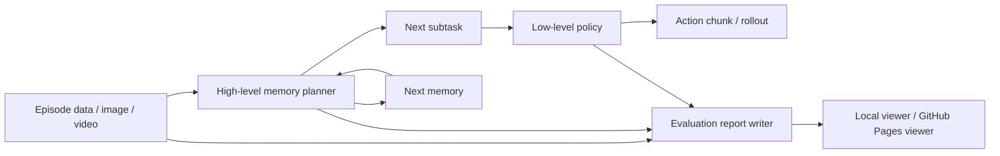

# open-pi-mem

Open research scaffold for reproducing a MEM-style hierarchical robot policy with explicit high-level memory, open data adapters, and inspectable RMBench-style evaluation reports.

> Status: research codebase / work in progress. The strongest part of the repository today is the high-level memory-planning loop and the viewer-ready Gemini reports. The full end-to-end low-level benchmark story is still incomplete.

`open-pi-mem` focuses on:

- single-frame high-level planning: `goal + image + prev_memory -> next_subtask + next_memory`
- RMBench video-based high-level evaluation with Gemini models
- RoboTwin policy-wrapper integration for low-level checkpoint evaluation
- a local and GitHub Pages-friendly viewer for report inspection
- minimal training and data scaffolding for open-data experiments

This is an open research scaffold, not an official release from Physical Intelligence. The design choices here are intentionally explicit where the paper is underspecified. See [`docs/design.md`](docs/design.md).

## Live Demo

- GitHub Pages viewer: [wingagi.github.io/open-pi-mem](https://wingagi.github.io/open-pi-mem/)

## Current Status

Completed:

- high-level inference from a local VLM on one image and textual memory state
- prompt and parsing logic for structured `<subtask>` and `<memory>` outputs
- manual and LLM-assisted memory-supervision data generation
- RMBench-style episode slicing for video evaluation
- saved comparison reports for `Gemini 3.1 Pro` and `Gemini Robotics-ER 1.5`
- a static viewer that can be deployed to GitHub Pages

Still in progress:

- full end-to-end MEM reproduction
- fully implemented high-level adapter inside low-level RMBench evaluation
- repository-owned trained low-level checkpoints for RoboTwin evaluation
- benchmark summary tables and stronger quantitative reporting
- deeper automated testing beyond smoke checks

## OpenPI / RoboTwin Boundary

`open-pi-mem` should not reimplement pi05. RoboTwin pi06 is intended to be:

```text
pi06 = official OpenPI/RoboTwin pi05 low-level policy + open-pi-mem MEM wrapper
```

The low-level VLA model, 14D qpos action chunks, camera/state encoding,
LeRobot conversion, checkpoint layout, normalization assets, training loop, and
remote inference runtime should come from Physical Intelligence OpenPI and the
RoboTwin pi05 policy. This repository owns the memory-planning interface,
subtask/memory traces, integration wrappers, and pi05/pi06 comparison tooling.
See [`docs/robotwin_pi06_architecture.md`](docs/robotwin_pi06_architecture.md).

For public OpenPI-style RoboTwin checkpoints, use
[`scripts/prepare_robotwin_pi05_checkpoint.py`](scripts/prepare_robotwin_pi05_checkpoint.py)
to install only inference files into RoboTwin's expected pi05 checkpoint layout.

## Pipeline Overview



## Quick Start

Install the base package:

```bash
python3 -m pip install -e .
```

For evaluation-related dependencies:

```bash
python3 -m pip install -e ".[eval]"
```

For the local development and RoboTwin integration checks:

```bash
python3 -m pip install -e ".[eval,dev]"
python3 -m pytest tests/test_robotwin_adapter.py tests/test_rmbench_adapter.py
```

To install the RoboTwin policy wrapper into a local RoboTwin checkout:

```bash
python3 scripts/install_robotwin_policy_wrapper.py --robotwin-root benchmarks/RoboTwin
python3 scripts/check_robotwin_integration.py --robotwin-root benchmarks/RoboTwin
```

The committed wrapper source lives under
[`integrations/robotwin/open_pi_mem_robotwin`](integrations/robotwin/open_pi_mem_robotwin);
`benchmarks/` remains local and is ignored because it contains external
repositories, simulator assets, and rollout output.

For pi05/pi06 RoboTwin evaluation, install all wrappers and start the OpenPI
model in the pi05 runtime:

```bash
python3 scripts/install_robotwin_policy_wrapper.py --robotwin-root benchmarks/RoboTwin --wrapper all

PYTHONPATH=$PWD/src \
CUDA_VISIBLE_DEVICES= \
OPENPI_PYTORCH_DEVICE=cpu \
TORCH_COMPILE_DISABLE=1 \
TORCHDYNAMO_DISABLE=1 \
benchmarks/RoboTwin/policy/pi05/.venv/bin/python scripts/serve_robotwin_pi05_policy.py \
  --robotwin-root benchmarks/RoboTwin \
  --mode pi05 \
  --train-config-name pi05_base_aloha_lora \
  --model-name C3I_pi05_Robotwin_50tasks_model_democlean \
  --checkpoint-id 35000 \
  --pi0-step 50 \
  --port 8105
```

Then run RoboTwin from its simulator environment with
`--policy_host 127.0.0.1 --policy_port 8105`. CPU mode is only a fallback for
smoke/debug runs; real success-rate benchmarks need a GPU that can hold both
the RoboTwin renderer and pi05/OpenPI model, or a separate remote policy GPU.

To build and preview the static viewer locally:

```bash
python3 scripts/run_test_viewer_app.py --host 127.0.0.1 --port 8766 --rebuild
```

Then open:

```text
http://127.0.0.1:8766/
```

## Included Results

The repository intentionally keeps viewer-ready qualitative artifacts in-repo under [`data/eval_results/`](data/eval_results), including:

- [`data/eval_results/Gemini_3_1_Pro`](data/eval_results/Gemini_3_1_Pro)
- [`data/eval_results/Gemini_Robotics_ER_1_5`](data/eval_results/Gemini_Robotics_ER_1_5)

These saved reports make it easy to inspect:

- how memory is updated over time
- whether subtasks stay atomic
- where models advance too early or remain conservative
- how two Gemini variants behave on the same task family

The GitHub Pages deployment publishes a curated subset of demos for size and reliability; the full report archive remains available in the repository.

## Documentation

- [Getting Started](docs/getting_started.md)
- [RoboTwin Integration](docs/robotwin_integration.md)
- [RoboTwin pi05/pi06 Architecture](docs/robotwin_pi06_architecture.md)
- [RoboTwin Self-Evolving MEM Agent](docs/robotwin_self_evolving_agent.md)
- [Data Formats And Results](docs/data_formats.md)
- [Design Notes](docs/design.md)
- [Contributing](CONTRIBUTING.md)

## References

- Torne et al., [MEM: Multi-Scale Embodied Memory for Vision Language Action Models](https://www.pi.website/download/Mem.pdf)
- Physical Intelligence, [VLAs with Long and Short-Term Memory](https://www.pi.website/research/memory)

## Repository Layout

```text
open-pi-mem/
├── configs/                 # Training and inference configs
├── data/                    # Saved reports, annotations, and local raw assets
├── docs/                    # Usage, design notes, and data format docs
├── examples/                # Sample JSONL data and toy frames
├── integrations/            # Small adapters copied into external benchmark checkouts
├── prompts/                 # Prompt templates for data generation
├── scripts/                 # Main entrypoints for training, inference, evaluation, and viewer
├── src/open_pi_mem/         # Library code
└── web/                     # Static viewer frontend
```

## License

This project is released under the MIT License. See [`LICENSE`](LICENSE).
